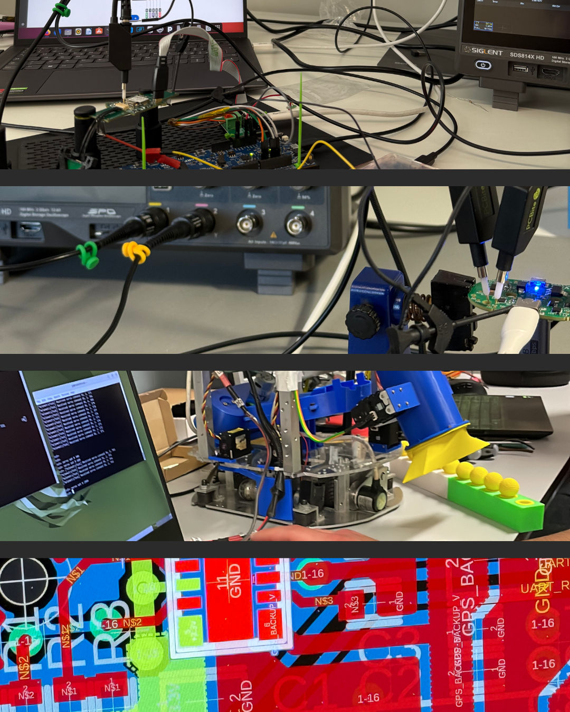

### Hi there 👋

#### I am Giovanni, a Computer Science student at University of Catania and developer at [@faradex](http://github.com/Faradex) and [@UniCT-ARSLAB](https://github.com/UniCT-ARSLab) 🤖

**Embedded Systems & IoT**  

**IoT, Protocolli & Networking**  

**Sviluppo Software & Web**  

**Strumenti, IDE & OS**  

### What can you find here? 🪐
Lots of projects I worked on, from embedded and IoT to Web dev. If you have any questions or tips, please fork or contact me!

  

